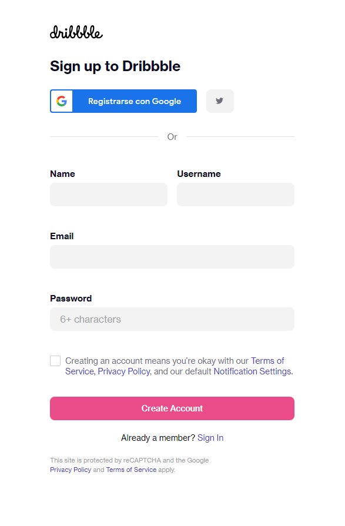
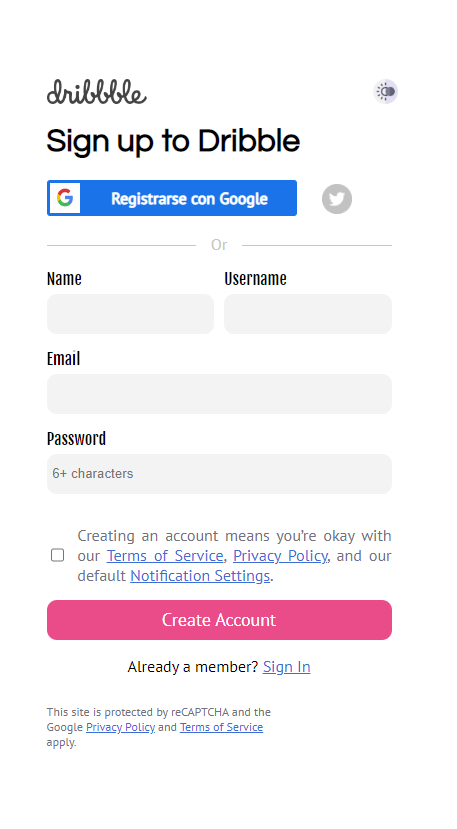
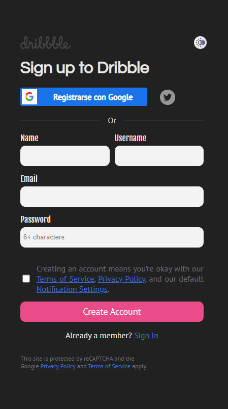
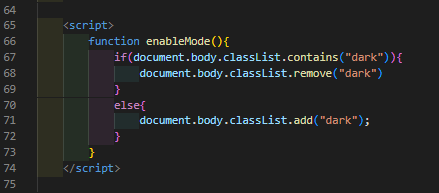

    <h1 style="text-align: center; font-family: 'Inconsolata', monospace;">Sign In Formulary with White and Dark mode</h1>
    

    

        

            Firstly, the main aim of this repository is to show my work adapting the actual (19/09/2022) sign in page at Dribble
            and try to include some changes. Also, a dark and white button. So, let's see both formularies:
        

        

            
            
        

        

            As you can see, both pages are pretty familiar. Just some changes like Twitter button and the use of different kind of
            text fonts. The "hover" functions are the same. But the most important change is the implementation of dark and white
            button. Let's compare my implementation with white and black background:
        

        

            
            
        

        

            The change could be possible thanks to script implementation. I used next code linked to dark and white button: 
        

        

            
        

        

            Hope it could be helpful to someone. For me, it was a great experience to grow my knowledge and try to improve in
            development world.
        

